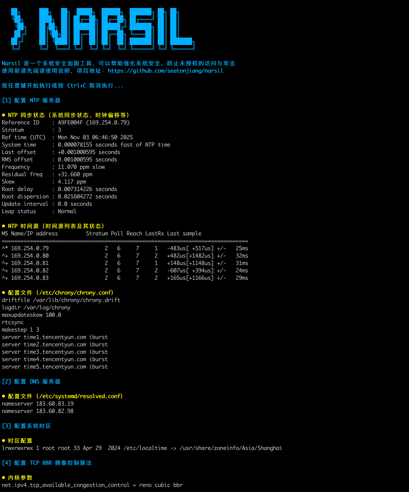
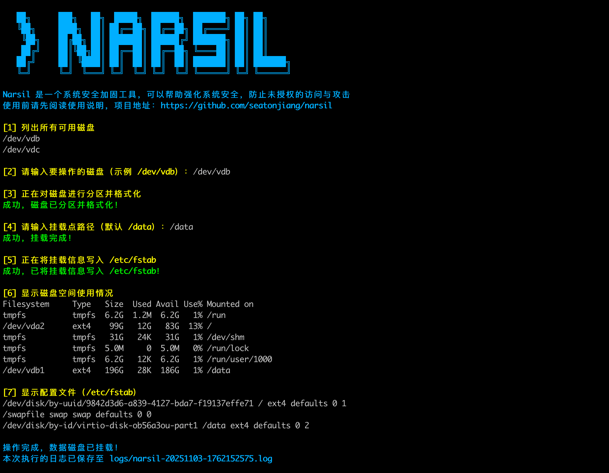
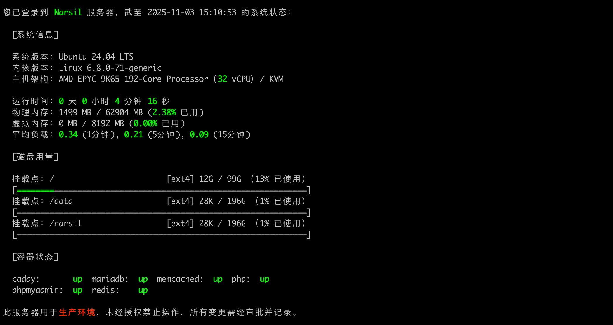

# Narsil

Narsil 是一个系统安全加固工具，可以帮助强化系统安全，防止未授权的访问与攻击。

## 💻 工具截图

### 自动加固



### 硬盘挂载



### 系统状态



## ✨ 工具特性

- 启用 TCP BBR 拥塞控制算法，优化网络性能
- 调整 Ulimit 配置，提升高并发处理能力
- 强化 OpenSSH 服务配置，提高远程连接的安全性
- 配置系统会话超时策略，在空闲自定义时间后自动断开连接
- 新用户默认禁用 SHELL 登录，需手动授权
- 密码过期 30 天后自动禁用账户
- 限制密码最长使用期限为 30 天
- 设置两次修改密码的时间间隔至少为 1 天
- 在密码过期前 7 天发出警告
- 将系统默认密码加密算法升级为 SHA512
- 配置 DNS 服务器（支持云服务器从元数据中获取内网配置）
- 配置 NTP 服务器（支持云服务器从元数据中获取内网配置）
- 交互修改系统主机名（支持云服务器从元数据中获取控制台配置）
- 交互挂载数据盘，简化磁盘的分区、格式化和挂载流程
- 根据内存大小自动创建 Swap 交换空间
- 一键清理系统中的各类日志文件，释放磁盘空间

还有很多特性没有被列举出来，可以参考 `scripts` 目录下的文件了解更多信息。

## 🚀 快速入门

### 第一步：克隆仓库

国外用户可以使用 GitHub 克隆仓库：

```bash
git clone --depth 1 https://github.com/seatonjiang/narsil.git
```

国内用户可以使用 CNB 克隆仓库：

```bash
git clone --depth 1 https://cnb.cool/seatonjiang/narsil.git
```

### 第二步：编辑配置

进入项目文件夹：

```bash
cd narsil/
```

核对配置文件中的配置信息：

```bash
vi narsil.conf
```

### 第三步：运行脚本

```bash
sudo bash narsil.sh
```

> 提示：需要使用 root 账号或 sudo 权限运行该脚本。

## 📝 配置文件

```ini
# 验证操作（每一项操作完成后显示验证信息）
VERIFY='Y'

# 云服务器元数据覆盖（DNS 服务器、NTP 服务器、主机名、Docker 镜像）
METADATA='Y'

# 生产环境提醒（登录时提示生产环境）
PROD_TIPS='Y'

# 无响应注销时间（单位：秒）
LOGOUT_TIME='300'

# SSH 端口配置
SSH_PORT='22'

# 时区配置
TIME_ZONE='Asia/Shanghai'

# 主机名配置（开启云服务器元数据覆盖，云服务器会自动设置为元数据的主机名）
HOSTNAME='Narsil'

# DNS 服务器配置（开启云服务器元数据覆盖，云服务器会自动设置为元数据的 DNS 服务器）
DNS_SERVER='119.29.29.29 223.5.5.5'

# NTP 服务器配置（开启云服务器元数据覆盖，云服务器会自动设置为元数据的 NTP 服务器）
NTP_SERVER='ntp1.tencent.com ntp2.tencent.com ntp3.tencent.com ntp4.tencent.com ntp5.tencent.com'

# Docker Engine 配置
DOCKER_CE_REPO='https://mirrors.cloud.tencent.com/docker-ce'

```

## 📂 目录结构

项目目录结构说明：

```bash
narsil
├── config                 配置文件目录
│   └── banner             登录横幅目录
├── logs                   日志文件目录
├── scripts                脚本文件目录
├── narsil.conf            配置文件
└── narsil.sh              主脚本文件
```

## 🔨 独立功能

Narsil 中包含了一些独立的功能，这些功能并不在自动执行的脚本中，需要使用参数单独使用，可以使用 `sudo bash narsil.sh -h` 命令查看所有独立功能。

### 清理日志

清理所有的系统日志文件。

> 建议在初始化系统之前先进行清理。

```bash
sudo bash narsil.sh -c
```

### 安装 Docker

安装 Docker 服务并设置镜像加速。

> 安装完成后，可以使用 `docker run hello-world` 测试 Docker 相关功能是否正常。

```bash
sudo bash narsil.sh -d
```

### 挂载硬盘

交互式挂载数据盘，数据无价，操作过程切记小心！

> 如果所选的硬盘已经被挂载，会提示解除挂载及格式化操作（腾讯云会优先使用弹性云硬盘的软链接方式挂载）。

```bash
sudo bash narsil.sh -f
```

### 修改主机名称

默认为 `Narsil`，如果 `METADATA=Y` 那么默认名称会是元数据中获取的 `instance-name` 数据。

```bash
sudo bash narsil.sh -n
```

### 删除腾讯云轻量服务器专属用户和组

删除腾讯云轻量服务器专属用户 `lighthouse` 和组 `lighthouse`。

```bash
sudo bash narsil.sh -l
```

### 修改端口

交互式修改 SSH 端口。

> 端口范围需要在 10000 到 65535 之间。

```bash
sudo bash narsil.sh -p
```

### 卸载监控

卸载服务商安装到服务器中的各种监控组件。

> 此功能目前仅支持腾讯云服务器。

```bash
sudo bash narsil.sh -r
```

### 添加交换空间

如果物理内存太小，建议添加交换空间。

```bash
sudo bash narsil.sh -s
```

## 💖 项目支持

如果这个项目为你带来了便利，请考虑为这个项目点个 Star 或者通过微信赞赏码支持我，每一份支持都是我持续优化和添加新功能的动力源泉！

<div align="center">
    <b>微信赞赏码</b>
    <br>
    
</div>

## 🤝 参与共建

我们欢迎所有的贡献，你可以将任何想法作为 [Pull Requests](https://github.com/seatonjiang/narsil/pulls) 或 [Issues](https://github.com/seatonjiang/narsil/issues) 提交。

## 📃 开源许可

项目基于 MIT 许可证发布，详细说明请参阅 [LICENSE](https://github.com/seatonjiang/narsil/blob/main/LICENSE) 文件。
